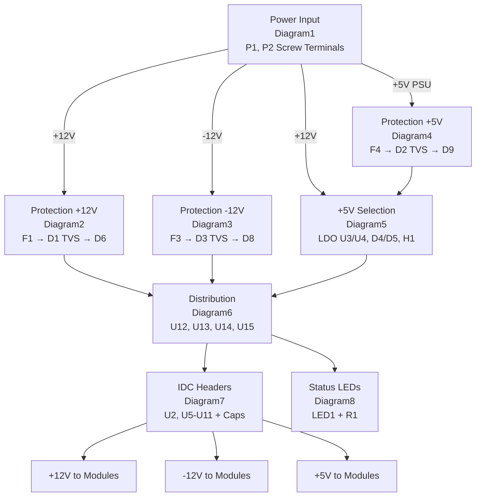

# Circuit Diagrams

Complete circuit configuration shown in stages. Each diagram represents a functional block of the zudo-bus power distribution board.

## Power Flow Overview

This diagram shows the complete power distribution chain from input terminals to IDC module headers, including the relationship between all circuit diagrams.



**Power Distribution Strategy:**

- **+12V rail**: Input → PTC F1 → TVS D1 → Reverse D6 → Distribution → IDC Headers
- **-12V rail**: Input → PTC F3 → TVS D3 → Reverse D8 → Distribution → IDC Headers
- **+5V rail**: Either PSU direct (via D5) or LDO from +12V (via D4) → Selected by H1 jumper

## Diagram1: Power Input Section

Screw terminals P1 and P2 receive power from the external PSU (zudo-pd or other Eurorack PSU).

```
Power Input Terminals:

P1 (5.08mm Screw Terminal - 2 positions):
┌─────────────────────────────────────┐
│  Pin 1: +12V input ─────────────────┼──→ To Protection (Diagram2)
│  Pin 2: GND ────────────────────────┼──→ System GND
└─────────────────────────────────────┘

P2 (5.08mm Screw Terminal - 2 positions):
┌─────────────────────────────────────┐
│  Pin 1: -12V input ─────────────────┼──→ To Protection (Diagram3)
│  Pin 2: GND ────────────────────────┼──→ System GND
└─────────────────────────────────────┘

Note: +5V input from PSU connects through the +5V protection path
      if using PSU direct mode (not LDO mode).
```

<details>
<summary>Connection List</summary>

**Components:**

| Ref | Part                     | Description        |
| --- | ------------------------ | ------------------ |
| P1  | 5.08mm Screw Terminal 2P | +12V and GND input |
| P2  | 5.08mm Screw Terminal 2P | -12V and GND input |

**Connections:**

- `P1 Pin 1` → `+12V in` net → To F1 (Diagram2)
- `P1 Pin 2` → `GND` net → System ground
- `P2 Pin 1` → `-12V in` net → To F3 (Diagram3)
- `P2 Pin 2` → `GND` net → System ground

</details>

## Diagram2: +12V Protection Path

The +12V rail protection consists of a PTC fuse, TVS clamp diode, and reverse polarity diode in series.

```
+12V Protection Path:

+12V in ──► F1 ──► D1 (TVS) ──► D6 ──► +12V rail
(from P1)   PTC    SMF12CA     SM4007
            2A     clamp       reverse
            hold   @19.9V      protect

Component Details:

F1 (BSMD1812-200-30V):
  │
  ├── Pin 1: +12V in (from P1)
  └── Pin 2: To D1

D1 (SMF12CA - TVS Diode):
  │
  ├── Anode 1: To F1 output
  ├── Anode 2: GND (bidirectional TVS)
  └── Clamping: 19.9V max

D6 (SM4007PL):
  │
  ├── Anode: From D1/F1 output
  ├── Cathode: +12V rail
  └── Purpose: Blocks reverse current
```

<details>
<summary>Connection List</summary>

**Components:**

| Ref | Part             | Description                            |
| --- | ---------------- | -------------------------------------- |
| F1  | BSMD1812-200-30V | PTC fuse, 2A hold, 4A trip             |
| D1  | SMF12CA          | TVS diode, 12V standoff, clamps @19.9V |
| D6  | SM4007PL         | 1N4007 equivalent, reverse protection  |

**Connections:**

- `+12V in` → `F1 Pin 1`
- `F1 Pin 2` → `D1 anode`
- `D1 cathode` → `GND` (TVS is bidirectional)
- `F1 Pin 2` → `D6 anode`
- `D6 cathode` → `+12V rail` net

**Protection Order:**

1. PTC fuse (F1) - Overcurrent protection, self-resetting
2. TVS diode (D1) - Transient voltage clamping
3. Reverse diode (D6) - Reverse polarity protection

</details>

## Diagram3: -12V Protection Path

The -12V rail uses the same protection topology as +12V but with appropriate polarity.

```
-12V Protection Path:

-12V in ──► F3 ──► D3 (TVS) ──► D8 ──► -12V rail
(from P2)   PTC    SMF12CA     SM4007
            2A     clamp       reverse
            hold   @19.9V      protect

Note: For -12V, "reverse" protection means blocking
      current flowing from GND toward -12V rail.

D8 (SM4007PL):
  │
  ├── Cathode: From -12V in (after F3)
  ├── Anode: -12V rail
  └── Purpose: Blocks reverse current from GND
```

<details>
<summary>Connection List</summary>

**Components:**

| Ref | Part             | Description                            |
| --- | ---------------- | -------------------------------------- |
| F3  | BSMD1812-150-33V | PTC fuse, 1.5A hold, 3A trip           |
| D3  | SMF12CA          | TVS diode, 12V standoff, clamps @19.9V |
| D8  | SM4007PL         | 1N4007 equivalent, reverse protection  |

**Connections:**

- `-12V in` → `F3 Pin 1`
- `F3 Pin 2` → `D3 anode`
- `D3 cathode` → `GND` (TVS is bidirectional)
- `F3 Pin 2` → `D8 cathode`
- `D8 anode` → `-12V rail` net

</details>

## Diagram4: +5V Protection Path (PSU Direct)

When using PSU-provided +5V (not LDO), this protection path is active.

```
+5V PSU Protection Path:

+5V PSU ──► F4 ──► D2 (TVS) ──► D9 ──► +5V in net
input       PTC    SMF5.0CA    SM4007
            1.5A   clamp       reverse
            hold   @9.2V       protect

Then to +5V selection (Diagram5):
+5V in net ──► D5 (SS14 Schottky) ──► H1 jumper ──► +5V rail
```

<details>
<summary>Connection List</summary>

**Components:**

| Ref | Part             | Description                          |
| --- | ---------------- | ------------------------------------ |
| F4  | BSMD1812-150-33V | PTC fuse, 1.5A hold                  |
| D2  | SMF5.0CA         | TVS diode, 5V standoff, clamps @9.2V |
| D9  | SM4007PL         | Reverse protection                   |

**Connections:**

- `+5V PSU` → `F4 Pin 1`
- `F4 Pin 2` → `D2 anode`
- `D2 cathode` → `GND`
- `F4 Pin 2` → `D9 anode`
- `D9 cathode` → `+5V in` net → To D5 in Diagram5

</details>

## Diagram5: +5V Selection (LDO and Jumper)

The +5V rail can be sourced from either:

1. On-board LDO (from +12V)
2. External PSU direct

Schottky diodes D4 and D5 form OR-ing protection.

```
+5V Source Selection:

                           +5V Selection with OR-ing

+12V rail ──► U3 ──► U4 ──► D4 (SS14) ──┐
             LED    LDO     Schottky    │
             drv    5V      cathode     │
                                        ├──► H1 ──► +5V rail
                                        │   Jumper
+5V in ─────────────────► D5 (SS14) ────┘
(from Diagram4)           Schottky
                          cathode

H1 Jumper (1x3 Header):
┌─────┐
│  1  │ LDO +5V output (via D4)
│  2  │ +5V rail (to distribution)
│  3  │ PSU +5V (via D5)
└─────┘

Jumper positions:
- 1-2: Use LDO (on-board 5V from 12V)
- 2-3: Use PSU direct +5V

LDO Section:
U3 (LED driver) provides current reference
U4 (78L05 or similar) regulates +12V down to +5V

OR-ing Diodes (D4, D5):
- Prevent backfeed between LDO and PSU
- Allow safe operation with any jumper configuration
- ~0.55V forward drop (Schottky)
```

<details>
<summary>Connection List</summary>

**Components:**

| Ref | Part               | Description                       |
| --- | ------------------ | --------------------------------- |
| U3  | YLED0603YG         | LED indicator/driver              |
| U4  | NCD1608A1 or 78L05 | +5V LDO regulator                 |
| D4  | SS14               | Schottky diode, LDO output OR-ing |
| D5  | SS14               | Schottky diode, PSU +5V OR-ing    |
| H1  | Header 1x3         | +5V source selection jumper       |
| C21 | 22uF               | LDO output capacitor              |

**Connections:**

- `+12V rail` → `U3 input`
- `U3 output` → `U4 input`
- `U4 output` → `LDO out` net
- `LDO out` → `D4 anode`
- `D4 cathode` → `H1 Pin 1`
- `+5V in` → `D5 anode`
- `D5 cathode` → `H1 Pin 3`
- `H1 Pin 2` → `+5V rail` net

</details>

## Diagram6: Power Distribution (U12-U15)

Distribution ICs buffer and distribute power to all IDC headers.

```
Power Distribution:

                     Distribution ICs (1217754-1)

+12V rail ──► U12 ──┬──► +12V to IDC headers
                   │
+12V rail ──► U15 ──┘

-12V rail ──► U13 ──────► -12V to IDC headers

+5V rail ──► U14 ──────► +5V to IDC headers


Each distribution IC provides:
- Low impedance power distribution
- Current sharing capability
- Clean power to multiple outputs
```

<details>
<summary>Connection List</summary>

**Components:**

| Ref | Part      | Description                  |
| --- | --------- | ---------------------------- |
| U12 | 1217754-1 | +12V distribution            |
| U13 | 1217754-1 | -12V distribution            |
| U14 | 1217754-1 | +5V distribution             |
| U15 | 1217754-1 | +12V distribution (parallel) |

**Connections:**

- `+12V rail` → `U12 input`, `U15 input`
- `-12V rail` → `U13 input`
- `+5V rail` → `U14 input`
- `U12 output`, `U15 output` → `+12V` to IDC headers
- `U13 output` → `-12V` to IDC headers
- `U14 output` → `+5V` to IDC headers

</details>

## Diagram7: IDC Headers and Decoupling

8 IDC headers (U2, U5-U11) provide power to Eurorack modules. Each header has dedicated decoupling capacitors.

```
IDC Header Layout (2x4 grid):

        Column 1        Column 2
Row 1   U2              U5
Row 2   U6              U7
Row 3   U8              U9
Row 4   U10             U11

Each IDC Header (2541WR-2X08P, 16-pin):
┌─────────────────────────────────────┐
│  Pins 1-2:   -12V                   │
│  Pins 3-8:   GND (x6)               │
│  Pins 9-12:  +12V (x4)              │
│  Pins 13-14: +5V (x2)               │
│  Pins 15-16: CV/GATE (optional)     │
└─────────────────────────────────────┘

Decoupling Capacitors (per header):
Each header has 2-3 capacitors placed adjacent:

+12V rail ──┬── Cx (0.1µF) ──┬── GND
            │                │
            └────────────────┴── To IDC +12V pins

-12V rail ──┬── Cy (0.1µF) ──┬── GND
            │                │
            └────────────────┴── To IDC -12V pins
```

<details>
<summary>Connection List</summary>

**Components:**

| Ref     | Part              | Description                 |
| ------- | ----------------- | --------------------------- |
| U2      | 2541WR-2X08P      | IDC header 16-pin           |
| U5      | 2541WR-2X08P      | IDC header 16-pin           |
| U6      | 2541WR-2X08P      | IDC header 16-pin           |
| U7      | 2541WR-2X08P      | IDC header 16-pin           |
| U8      | 2541WR-2X08P      | IDC header 16-pin           |
| U9      | 2541WR-2X08P      | IDC header 16-pin           |
| U10     | 2541WR-2X08P      | IDC header 16-pin           |
| U11     | 2541WR-2X08P      | IDC header 16-pin           |
| C1-C12  | CC0603KRX7R9BB104 | 0.1µF decoupling (Column 1) |
| C13-C23 | CC0603KRX7R9BB104 | 0.1µF decoupling (Column 2) |

**Capacitor Assignment:**

| Header | +12V Cap | -12V Cap | +5V Cap |
| ------ | -------- | -------- | ------- |
| U2     | C1       | C2       | C3      |
| U5     | C13      | C14      | -       |
| U6     | C4       | C5       | -       |
| U7     | C15      | C16      | -       |
| U8     | C6       | C7       | -       |
| U9     | C17      | C18      | C19     |
| U10    | C8       | C9       | -       |
| U11    | C20      | C21      | C22     |

**IDC Pin Connections (each header):**

- `Pins 1, 2` → `-12V rail`
- `Pins 3, 4, 5, 6, 7, 8` → `GND rail`
- `Pins 9, 10, 11, 12` → `+12V rail`
- `Pins 13, 14` → `+5V rail`
- `Pins 15, 16` → `CV rail`, `GATE rail` (optional)

</details>

## Diagram8: Status LED Circuit

LED1 indicates power status.

```
Status LED:

+12V rail
    │
    ├── R1 (current sense)
    │     │
    │     └── To distribution
    │
    └── LED1 circuit (via U3)
         │
        GND

LED1 (Power Indicator):
- Lights when +12V rail is active
- Current limited by driver circuit
```

<details>
<summary>Connection List</summary>

**Components:**

| Ref  | Part           | Description              |
| ---- | -------------- | ------------------------ |
| LED1 | KT-0603R       | Red LED, power indicator |
| R1   | 0805W8J0102T5E | Current sense resistor   |
| U3   | YLED0603YG     | LED driver               |

**Connections:**

- `+12V rail` → `R1` → Current sense
- `U3` drives `LED1`
- `LED1 cathode` → `GND`

</details>

## Component Summary

### All Components by Diagram

| Diagram  | Components              |
| -------- | ----------------------- |
| Diagram1 | P1, P2                  |
| Diagram2 | F1, D1, D6              |
| Diagram3 | F3, D3, D8              |
| Diagram4 | F4, D2, D9              |
| Diagram5 | U3, U4, D4, D5, H1, C21 |
| Diagram6 | U12, U13, U14, U15      |
| Diagram7 | U2, U5-U11, C1-C23      |
| Diagram8 | LED1, R1                |

### Net Names

| Net       | Description                      |
| --------- | -------------------------------- |
| +12V in   | Input from PSU before protection |
| -12V in   | Input from PSU before protection |
| +5V in    | Input from PSU before protection |
| +12V rail | Protected +12V distribution      |
| -12V rail | Protected -12V distribution      |
| +5V rail  | Selected +5V (LDO or PSU)        |
| GND rail  | System ground                    |
| LDO out   | +5V from on-board LDO            |
| LDO in    | +12V input to LDO                |
| CV rail   | Optional CV bus                  |
| GATE rail | Optional GATE bus                |

## See Also

- [Technical Overview](./overview.md) - Design rationale
- [Bill of Materials](./bom.md) - Component list
- [Current Status](../inbox/current-status.md) - Detailed connection list
