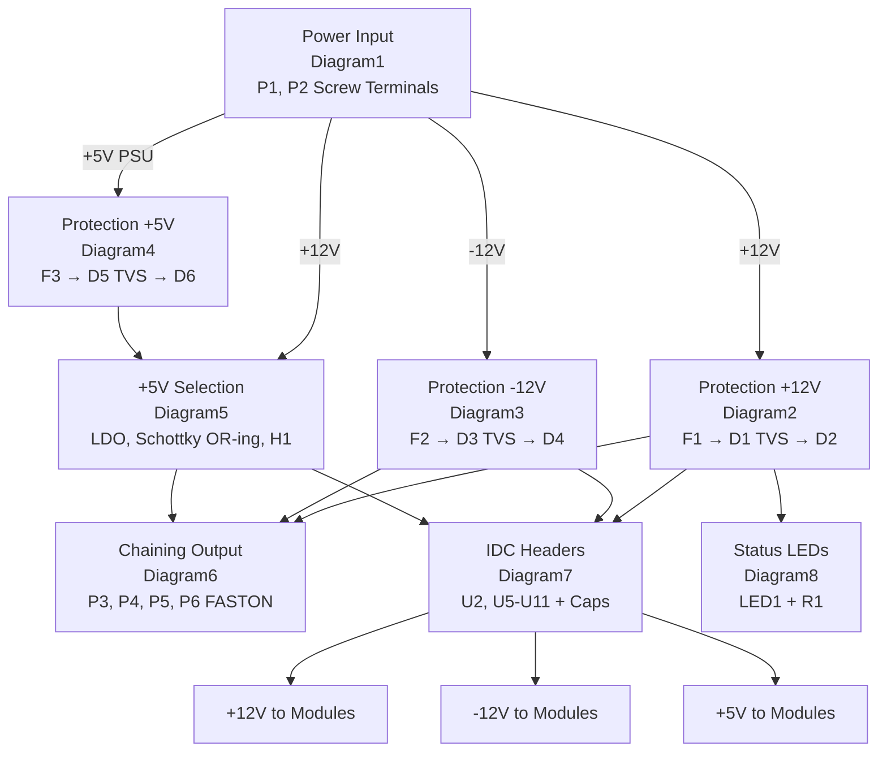

# Circuit Diagrams

Complete circuit configuration shown in stages. Each diagram represents a functional block of the zudo-bus power distribution board.

## Power Flow Overview

This diagram shows the complete power distribution chain from input terminals to IDC module headers, including the relationship between all circuit diagrams.



**Power Distribution Strategy:**

- **+12V rail**: Input → PTC F1 → TVS D1 → Reverse D2 → Distribution → IDC Headers
- **-12V rail**: Input → PTC F2 → TVS D3 → Reverse D4 → Distribution → IDC Headers
- **+5V rail**: Input → PTC F3 → TVS D5 → Reverse D6 → `+5V PSU` → OR-ing → H1 jumper → `+5V rail`

## Diagram1: Power Input Section

Screw terminals P1 and P2 receive power from the external PSU (zudo-pd or other Eurorack PSU).

```
Power Input Terminals:

P1 (5.08mm Screw Terminal - 2 positions):
┌─────────────────────────────────────┐
│  Pin 1: GND ────────────────────────┼──→ System GND
│  Pin 2: -12V input ─────────────────┼──→ To Protection (Diagram3)
└─────────────────────────────────────┘

P2 (5.08mm Screw Terminal - 2 positions):
┌─────────────────────────────────────┐
│  Pin 1: +5V input ──────────────────┼──→ To Protection (Diagram4)
│  Pin 2: +12V input ─────────────────┼──→ To Protection (Diagram2)
└─────────────────────────────────────┘
```

<details>
<summary>Connection List</summary>

**Components:**

| Ref | Part                     | Description        | KiCad Symbol                   |
| --- | ------------------------ | ------------------ | ------------------------------ |
| P1  | 5.08mm Screw Terminal 2P | -12V and GND input | zudo-bus:WJ500V-5.08-2P-14-00A |
| P2  | 5.08mm Screw Terminal 2P | +12V and +5V input | zudo-bus:WJ500V-5.08-2P-14-00A |

**Net Connections:**

| Component | Pin | Net     | Description      |
| --------- | --- | ------- | ---------------- |
| P1        | 1   | GND     | System ground    |
| P1        | 2   | -12V in | To F2 (Diagram3) |
| P2        | 1   | +5V in  | To F3 (Diagram4) |
| P2        | 2   | +12V in | To F1 (Diagram2) |

</details>

## Diagram2: +12V Protection Path

The +12V rail protection consists of a PTC fuse, TVS clamp diode, and reverse polarity diode in series.

```
+12V Protection Path:

+12V in ──► F1 ──┬──► D2 ──► +12V rail
(from P2)   PTC  │   SM4007
            2A   │   reverse protect
            hold │
                 └── D1 (TVS) ── GND
                     SMF12CA
                     clamp @19.9V
```

<details>
<summary>Connection List</summary>

**Components:**

| Ref | Part             | Description                            |
| --- | ---------------- | -------------------------------------- |
| F1  | BSMD1812-200-30V | PTC fuse, 2A hold, 4A trip             |
| D1  | SMF12CA          | TVS diode, 12V standoff, clamps @19.9V |
| D2  | SM4007PL         | 1N4007 equivalent, reverse protection  |

**Connections:**

| Component | Pin | Net        | Description     |
| --------- | --- | ---------- | --------------- |
| F1        | 1   | +12V in    | From P2 Pin 2   |
| F1        | 2   | (junction) | To D1 and D2    |
| D1        | A1  | (junction) | TVS clamp       |
| D1        | A2  | GND        | TVS to ground   |
| D2        | 2   | (junction) | Anode from F1   |
| D2        | 1   | +12V rail  | Cathode to rail |

</details>

## Diagram3: -12V Protection Path

The -12V rail uses the same protection topology as +12V but with appropriate polarity.

```
-12V Protection Path:

-12V in ──► F2 ──┬──► D4 ──► -12V rail
(from P1)   PTC  │   SM4007
            2A   │   reverse protect
            hold │   (REVERSED polarity)
                 └── D3 (TVS) ── GND
                     SMF12CA
                     clamp @19.9V

Note: D4 is oriented OPPOSITE to D2 (+12V path).
      Cathode at input, Anode at rail.
```

<details>
<summary>Connection List</summary>

**Components:**

| Ref | Part             | Description                            |
| --- | ---------------- | -------------------------------------- |
| F2  | BSMD1812-200-30V | PTC fuse, 2A hold, 4A trip             |
| D3  | SMF12CA          | TVS diode, 12V standoff, clamps @19.9V |
| D4  | SM4007PL         | 1N4007 equivalent, reverse protection  |

**Connections:**

| Component | Pin | Net        | Description              |
| --------- | --- | ---------- | ------------------------ |
| F2        | 1   | -12V in    | From P1 Pin 2            |
| F2        | 2   | (junction) | To D3 and D4             |
| D3        | A1  | (junction) | TVS clamp                |
| D3        | A2  | GND        | TVS to ground            |
| D4        | 1   | (junction) | Cathode from F2 (note!)  |
| D4        | 2   | -12V rail  | Anode to rail (reversed) |

</details>

## Diagram4: +5V Protection Path (PSU Direct)

When using PSU-provided +5V (not LDO), this protection path is active.

```
+5V Protection Path:

+5V in ──► F3 ──┬──► D6 ──► +5V PSU
(from P2)  PTC  │   SM4007
           1.5A │   reverse protect
           hold │
                └── D5 (TVS) ── GND
                    SMF5.0CA
                    clamp @9.2V

Then to +5V selection (Diagram5):
+5V PSU ──► Schottky OR-ing ──► H1 jumper ──► +5V rail
```

<details>
<summary>Connection List</summary>

**Components:**

| Ref | Part             | Description                          |
| --- | ---------------- | ------------------------------------ |
| F3  | BSMD1812-150-33V | PTC fuse, 1.5A hold                  |
| D5  | SMF5.0CA         | TVS diode, 5V standoff, clamps @9.2V |
| D6  | SM4007PL         | Reverse protection                   |

**Connections:**

| Component | Pin | Net        | Description       |
| --------- | --- | ---------- | ----------------- |
| F3        | 1   | +5V in     | From P2 Pin 1     |
| F3        | 2   | (junction) | To D5 and D6      |
| D5        | A1  | (junction) | TVS clamp         |
| D5        | A2  | GND        | TVS to ground     |
| D6        | 2   | (junction) | Anode from F3     |
| D6        | 1   | +5V PSU    | Cathode to OR-ing |

</details>

## Diagram5: +5V Selection (LDO and Jumper)

The +5V rail can be sourced from either:

1. On-board LDO (from +12V)
2. External PSU direct

Schottky diodes D4 and D5 form OR-ing protection.

```
+5V Source Selection:

                           +5V Selection with OR-ing

+12V rail ──► U3 ──► U4 ──► D4 (SS14) ──┐
             LED    LDO     Schottky    │
             drv    5V      cathode     │
                                        ├──► H1 ──► +5V rail
                                        │   Jumper
+5V in ─────────────────► D5 (SS14) ────┘
(from Diagram4)           Schottky
                          cathode

H1 Jumper (1x3 Header):
┌─────┐
│  1  │ LDO +5V output (via D4)
│  2  │ +5V rail (to distribution)
│  3  │ PSU +5V (via D5)
└─────┘

Jumper positions:
- 1-2: Use LDO (on-board 5V from 12V)
- 2-3: Use PSU direct +5V

LDO Section:
U3 (LED driver) provides current reference
U4 (78L05 or similar) regulates +12V down to +5V

OR-ing Diodes (D4, D5):
- Prevent backfeed between LDO and PSU
- Allow safe operation with any jumper configuration
- ~0.55V forward drop (Schottky)
```

<details>
<summary>Connection List</summary>

**Components:**

| Ref | Part               | Description                       |
| --- | ------------------ | --------------------------------- |
| U3  | YLED0603YG         | LED indicator/driver              |
| U4  | NCD1608A1 or 78L05 | +5V LDO regulator                 |
| D4  | SS14               | Schottky diode, LDO output OR-ing |
| D5  | SS14               | Schottky diode, PSU +5V OR-ing    |
| H1  | Header 1x3         | +5V source selection jumper       |
| C21 | 22uF               | LDO output capacitor              |

**Connections:**

- `+12V rail` → `U3 input`
- `U3 output` → `U4 input`
- `U4 output` → `LDO out` net
- `LDO out` → `D4 anode`
- `D4 cathode` → `H1 Pin 1`
- `+5V in` → `D5 anode`
- `D5 cathode` → `H1 Pin 3`
- `H1 Pin 2` → `+5V rail` net

</details>

## Diagram6: Bus Board Chaining (FASTON Connectors)

FASTON 250 terminals allow daisy-chaining multiple bus boards or parallel power input.

```
Bus Board Chaining (Input Side):

-12V in ──────► P3 ──────► To/from another bus board -12V
GND     ──────► P4 ──────► To/from another bus board GND
+12V in ──────► P5 ──────► To/from another bus board +12V
+5V in  ──────► P6 ──────► To/from another bus board +5V

FASTON 250 terminals (1217754-1):
- Quick connect/disconnect for modular expansion
- 7A rated per terminal
- Compatible with standard 6.3mm FASTON receptacles
- Connected to input nets (each board has its own protection)
```

<details>
<summary>Connection List</summary>

**Components:**

| Ref | Part      | Description         |
| --- | --------- | ------------------- |
| P3  | 1217754-1 | -12V chain (FASTON) |
| P4  | 1217754-1 | GND chain (FASTON)  |
| P5  | 1217754-1 | +12V chain (FASTON) |
| P6  | 1217754-1 | +5V chain (FASTON)  |

**Connections:**

| Component | Pin | Net     | Description            |
| --------- | --- | ------- | ---------------------- |
| P3        | 1   | -12V in | To next bus board -12V |
| P4        | 1   | GND     | To next bus board GND  |
| P5        | 1   | +12V in | To next bus board +12V |
| P6        | 1   | +5V in  | To next bus board +5V  |

</details>

## Diagram7: IDC Headers and Decoupling

8 IDC headers (U2, U5-U11) provide power to Eurorack modules. Each header has dedicated decoupling capacitors.

```
IDC Header Layout (2x4 grid):

        Column 1        Column 2
Row 1   U2              U5
Row 2   U6              U7
Row 3   U8              U9
Row 4   U10             U11

Each IDC Header (2541WR-2X08P, 16-pin):
┌─────────────────────────────────────┐
│  Pins 1-2:   -12V                   │
│  Pins 3-8:   GND (x6)               │
│  Pins 9-12:  +12V (x4)              │
│  Pins 13-14: +5V (x2)               │
│  Pins 15-16: CV/GATE (optional)     │
└─────────────────────────────────────┘

Decoupling Capacitors (per header):
Each header has 2-3 capacitors placed adjacent:

+12V rail ──┬── Cx (0.1µF) ──┬── GND
            │                │
            └────────────────┴── To IDC +12V pins

-12V rail ──┬── Cy (0.1µF) ──┬── GND
            │                │
            └────────────────┴── To IDC -12V pins
```

<details>
<summary>Connection List</summary>

**Components:**

| Ref     | Part              | Description                 |
| ------- | ----------------- | --------------------------- |
| U2      | 2541WR-2X08P      | IDC header 16-pin           |
| U5      | 2541WR-2X08P      | IDC header 16-pin           |
| U6      | 2541WR-2X08P      | IDC header 16-pin           |
| U7      | 2541WR-2X08P      | IDC header 16-pin           |
| U8      | 2541WR-2X08P      | IDC header 16-pin           |
| U9      | 2541WR-2X08P      | IDC header 16-pin           |
| U10     | 2541WR-2X08P      | IDC header 16-pin           |
| U11     | 2541WR-2X08P      | IDC header 16-pin           |
| C1-C12  | CC0603KRX7R9BB104 | 0.1µF decoupling (Column 1) |
| C13-C23 | CC0603KRX7R9BB104 | 0.1µF decoupling (Column 2) |

**Capacitor Assignment:**

| Header | +12V Cap | -12V Cap | +5V Cap |
| ------ | -------- | -------- | ------- |
| U2     | C1       | C2       | C3      |
| U5     | C13      | C14      | -       |
| U6     | C4       | C5       | -       |
| U7     | C15      | C16      | -       |
| U8     | C6       | C7       | -       |
| U9     | C17      | C18      | C19     |
| U10    | C8       | C9       | -       |
| U11    | C20      | C21      | C22     |

**IDC Pin Connections (each header):**

- `Pins 1, 2` → `-12V rail`
- `Pins 3, 4, 5, 6, 7, 8` → `GND rail`
- `Pins 9, 10, 11, 12` → `+12V rail`
- `Pins 13, 14` → `+5V rail`
- `Pins 15, 16` → `CV rail`, `GATE rail` (optional)

</details>

## Diagram8: Status LED Circuit

LED1 indicates power status.

```
Status LED:

+12V rail
    │
    ├── R1 (current sense)
    │     │
    │     └── To distribution
    │
    └── LED1 circuit (via U3)
         │
        GND

LED1 (Power Indicator):
- Lights when +12V rail is active
- Current limited by driver circuit
```

<details>
<summary>Connection List</summary>

**Components:**

| Ref  | Part           | Description              |
| ---- | -------------- | ------------------------ |
| LED1 | KT-0603R       | Red LED, power indicator |
| R1   | 0805W8J0102T5E | Current sense resistor   |
| U3   | YLED0603YG     | LED driver               |

**Connections:**

- `+12V rail` → `R1` → Current sense
- `U3` drives `LED1`
- `LED1 cathode` → `GND`

</details>

## Component Summary

### All Components by Diagram

| Diagram  | Components               |
| -------- | ------------------------ |
| Diagram1 | P1, P2                   |
| Diagram2 | F1, D1 (TVS), D2         |
| Diagram3 | F2, D3 (TVS), D4         |
| Diagram4 | F3, D5 (TVS), D6         |
| Diagram5 | LDO, Schottky OR-ing, H1 |
| Diagram6 | P3, P4, P5, P6 (FASTON)  |
| Diagram7 | IDC Headers + Caps       |
| Diagram8 | Status LEDs              |

### Net Names

| Net       | Description                           |
| --------- | ------------------------------------- |
| +12V in   | Input from PSU before protection      |
| -12V in   | Input from PSU before protection      |
| +5V in    | Input from PSU before protection      |
| +12V rail | Protected +12V distribution           |
| -12V rail | Protected -12V distribution           |
| +5V PSU   | Protected PSU +5V (before OR-ing)     |
| +5V LDO   | LDO output (before OR-ing)            |
| +5V rail  | Selected +5V (after jumper selection) |
| GND       | System ground                         |
| CV rail   | Optional CV bus                       |
| GATE rail | Optional GATE bus                     |

## See Also

- [Technical Overview](./overview.md) - Design rationale
- [Bill of Materials](./bom.md) - Component list
- [Current Status](../inbox/current-status.md) - Detailed connection list
